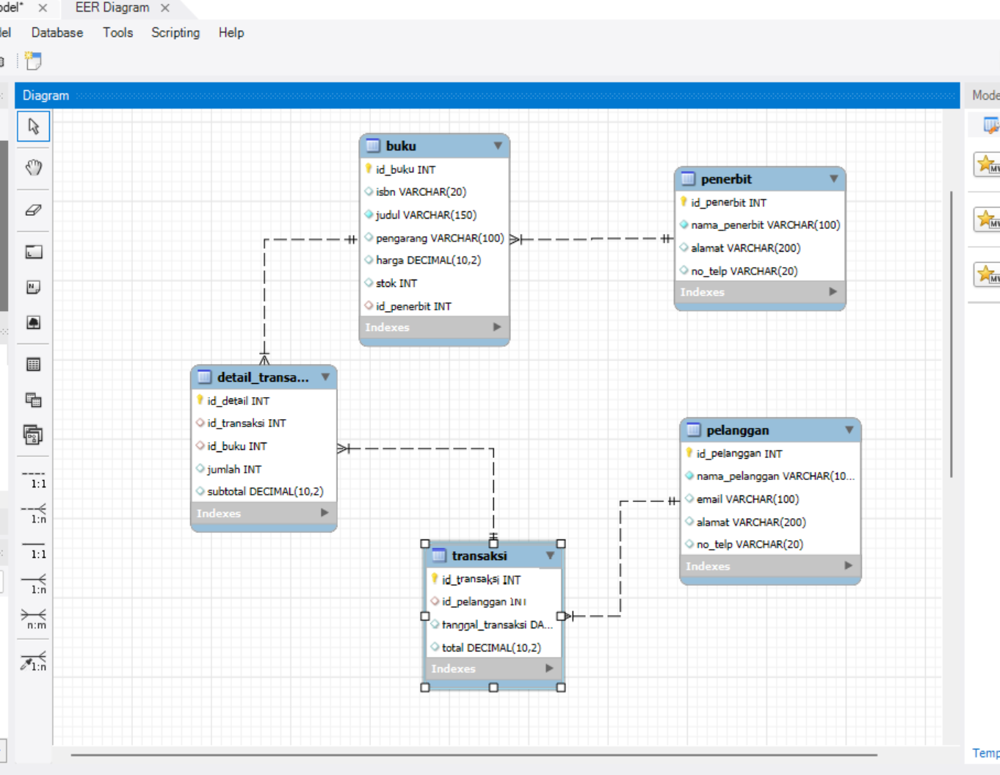

<html lang="id">
<head>
  <meta charset="UTF-8">
  <meta name="viewport" content="width=device-width, initial-scale=1.0">
  <title>Blog Galaxy Hijau Neon</title>

  <!-- Font & Icon -->
  <link rel="stylesheet" href="https://cdnjs.cloudflare.com/ajax/libs/font-awesome/6.5.0/css/all.min.css">

  
</head>

<body>
  

    <!-- Icon Dekorasi -->
    <i class="fas fa-star icon-decor icon1"></i>
    <i class="fas fa-meteor icon-decor icon2"></i>
    <i class="fas fa-rocket icon-decor icon3"></i>

    <!-- Header -->
    <header>
      <h1>Blog Basis Data</h1>
      
<strong>NAJMI SHAUKY KAMIL</strong> · if24.najmikamil@mhsubpkarawang.ac.id

    </header>

    <!-- Posts -->
    <section class="posts">
      

        <h2><i class="fas fa-code"></i> Post 1: Apa itu Primary Key, Foreign Key, dan Candidate Key?</h2>
        
<strong>→ Primary Key</strong> adalah kolom unik untuk identitas tiap data, tidak boleh kosong atau ganda.
         <strong>→ Foreign Key</strong> adalah kolom yang menghubungkan tabel satu dengan tabel lain, nilainya berasal dari Primary Key tabel lain.
         <strong>→ Candidate Key</strong> adalah kolom yang berpotensi jadi Primary Key karena nilainya juga unik.

      <h2>🧩 Struktur SQL Sistem Toko Buku</h2>
  <pre> 
      -- ===============================
      -- DATABASE TOKO BUKU
      -- ===============================

      CREATE DATABASE toko_buku;
      USE toko_buku;

      -- ===============================
      -- 1. TABEL PENERBIT
      -- ===============================
      CREATE TABLE penerbit (
        id_penerbit INT AUTO_INCREMENT PRIMARY KEY,
        nama_penerbit VARCHAR(100) NOT NULL UNIQUE,  -- Candidate Key
        alamat VARCHAR(200),
        no_telp VARCHAR(20)
      );

      -- ===============================
      -- 2. TABEL BUKU
      -- ===============================
      CREATE TABLE buku (
        id_buku INT AUTO_INCREMENT PRIMARY KEY,
        isbn VARCHAR(20) UNIQUE,                     -- Candidate Key
        judul VARCHAR(150) NOT NULL,
        pengarang VARCHAR(100),
        harga DECIMAL(10,2),
        stok INT,
        id_penerbit INT,
        FOREIGN KEY (id_penerbit) REFERENCES penerbit(id_penerbit)
          ON UPDATE CASCADE ON DELETE SET NULL
      );

      -- ===============================
      -- 3. TABEL PELANGGAN
      -- ===============================
      CREATE TABLE pelanggan (
        id_pelanggan INT AUTO_INCREMENT PRIMARY KEY,
        nama_pelanggan VARCHAR(100) NOT NULL,
        email VARCHAR(100) UNIQUE,                   -- Candidate Key
        alamat VARCHAR(200),
        no_telp VARCHAR(20)
      );

      -- ===============================
      -- 4. TABEL TRANSAKSI
      -- ===============================
      CREATE TABLE transaksi (
        id_transaksi INT AUTO_INCREMENT PRIMARY KEY,
        id_pelanggan INT,
        tanggal_transaksi DATE,
        total DECIMAL(10,2),
        FOREIGN KEY (id_pelanggan) REFERENCES pelanggan(id_pelanggan)
          ON UPDATE CASCADE ON DELETE SET NULL
      );

      -- ===============================
      -- 5. TABEL DETAIL TRANSAKSI
      -- ===============================
      CREATE TABLE detail_transaksi (
        id_detail INT AUTO_INCREMENT PRIMARY KEY,
        id_transaksi INT,
        id_buku INT,
        jumlah INT,
        subtotal DECIMAL(10,2),
        FOREIGN KEY (id_transaksi) REFERENCES transaksi(id_transaksi)
          ON UPDATE CASCADE ON DELETE CASCADE,
        FOREIGN KEY (id_buku) REFERENCES buku(id_buku)
          ON UPDATE CASCADE ON DELETE SET NULL
      );
  </pre>

    

        
        
Gambar: Contoh relasi tabel dengan Primary Key,Foreign Key, dan Candidate Key

      

      

      

        <h2><i class="fas fa-brain"></i> Post 2: Relation pada ERD & Many-to-Many</h2>
        
Relation menggambarkan hubungan antar tabel dalam ERD.
         Jenisnya ada:
          <li>One to One (1:1)</li>
          <li>One to Many (1:M)</li>
          <li>OMany to Many (M:N)</li>
         Hubungan Many-to-Many tidak baik digunakan karena membuat data sulit diatur dan tidak bisa langsung diterapkan di SQL.
         Solusinya adalah membuat tabel penghubung, misalnya detail_transaksi yang menghubungkan tabel buku dan transaksi.

    </section>

    <!-- Footer -->
    <footer>
      
Teknik Informatika <a href="https://www.ubpkarawang.ac.id" target="_blank">UBP Karawang</a> 🚀

    </footer>

  

